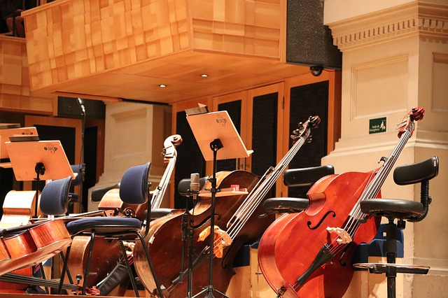

<!DOCTYPE html>
<html>
<head>

	<meta charset="UTF-8">
	<meta name="viewport" content="width=device-width, initial-scale=1">

	<meta name="Author" content="">
	<meta name="Keywords" content="contrabass 콘트라베이스 더블베이스 한국아마추어콘트라베이스협회">
	<meta name="Description" content="이 페이지는 한국아마추어콘트라베이스협회 홈페이지입니다. ">
<title>AmaCB</title>

<link rel=" shortcut icon" href="./image/clef.ico">
<link rel="icon" href="./image/clef.ico">

<link rel="stylesheet" href="styler01.css">
<link rel="stylesheet" href="fontstyle.css">

</head>
<body>

<!-- Links (sit on top) -->

  

    

      <a href="#" class="w3-button w3-block w3-black">HOME</a>
    

    

      <a href="#about" class="w3-button w3-block w3-black">ABOUT</a>
    

    

      <a href="#menu" class="w3-button w3-block w3-black">PEOPLE</a>
    

    

      <a href="#where" class="w3-button w3-block w3-black">WHERE</a>
    

  

<!-- Header with image -->
<header class="bgimg w3-display-container w3-grayscale-min" id="home">
  

    Enjoy your life with Contrabass
  

  

    한국아마추어콘트라베이스협회 
    Korea Amateur Contrabass Association
  

  

    Only those who have played the contrabass know the charm
  

</header>

<!-- Add a background color and large text to the whole page -->

<!-- About Container -->

  

    <h5 class="w3-center w3-padding-64">ABOUT THE ASSOCIATION</h5>
    
2016년 여기저기서 알음알음 베이스를 해오던 사람들이 우연히 함께 공연을 했습니다. 이렇게 많은 아마추어 클래식 콘트라베이시스트들을 만나보지 못했던 그들은 너무나 즐거웠습니다. 그 여운을 잊지못하고, 그들은 협회를 조성하게 되었습니다. 지금까지 협회원들은 각자의 뮤직라이프를 즐기고 있습니다. 

    
한국아마추어콘트라베이스협회는 콘트라베이스로 1회 이상 공연을 한 모두에게 열려있습니다. 

    

      
<i>Dr.A한테 한마디 해달라고 했는데 아직 답이 없습니다. </i>

      
협회장 : Dr.A 

    

    
    
<strong>Available Seasons:</strong> whenever they are free from their occupation

    <!--
<strong>Address:</strong> 15 Adr street, 5015, NY
-->
  

<!-- Menu Container -->

  

 
    <h5 class="w3-center w3-padding-48">PEOPLE</h5>
  
    

      <a href="javascript:void(0)" onclick="openMenu(event, 'Eat');" id="myLink">
        
Members
  
      </a>
		
각 멤버의 이름을 누르면 개인페이지를 볼 수 있습니다.
  
      <!--
      <a href="javascript:void(0)" onclick="openMenu(event, 'Drinks');">
        
Drink

      </a>
      -->

    

    

      <h5><a href="https://earlgreybutter.github.io/" title="W3.CSS" target="_blank" class="w3-hover-text-green">earlgreybutter</a></h5>
      
이 페이지를 만든 애. 여기서 제일 귀여운 애. 백앤드 개발자로 취직하고 싶어여. 취직시켜주세여.
 
    
      <h5>ㅇㅈ</h5>
      
이 페이지를 만들고 있는 사람이 한번도 뵙지 못해서 할말이 없습니다. 
 
    
      <h5>ㅈㅁ</h5>
      
1박2일 출연자
 
    
      <h5>ㅅㅇ</h5>
      
공돌-기계를 잘안다고 한다
 
    
      <h5>ㅈㅇ</h5>
      
태국어 마스터, 태국어 관련 각종 행사 경험 풍부

      
      <h5>Ginny</h5>
      
알라딘의 친구

      
      <h5><a href="https://www.youtube.com/channel/UCHEN870Kz7p8Bn4ss8wJICQ" title="W3.CSS" target="_blank" class="w3-hover-text-green">이주한</a></h5>
      
친구가 없어서 집에서 자가격리 겸 작업 가능한 시대가 부르는 뮤지션...!(+콘이 방망이 휘두르는 이모티콘) 

      
      <h5>Dr.A</h5>
      
지휘가능

      <h5>ㅇㅈ2</h5>
      
법잘알

      <h5>ㅇㄴ</h5>
      
중국어 네이티브

    

<!--
    

      <h5>Coffee</h5>
      
Regular coffee 2.50
 
    
      <h5>Chocolato</h5>
      
Chocolate espresso with milk 4.50
 
    
      <h5>Corretto</h5>
      
Whiskey and coffee 5.00
 
    
      <h5>Iced tea</h5>
      
Hot tea, except not hot 3.00
 
    
      <h5>Soda</h5>
      
Coke, Sprite, Fanta, etc. 2.50

    
  
    -->
    
  

<!-- Contact/Area Container -->

  

    <h5 class="w3-center w3-padding-48">WHERE TO FIND US</h5>
    
Find us in Korea.

    
    
모두들 반가워요! 여기저기 다니면서 공연하는 것을 상당히 즐기며 모든 협회원들은 객원 경험이 풍부합니다.

    <!--
    
<strong>Reserve</strong> a table, ask for today's special or just send us a message:

    <form action="/action_page.php" target="_blank">
      
<input class="w3-input w3-padding-16 w3-border" type="text" placeholder="Name" required name="Name">

      
<input class="w3-input w3-padding-16 w3-border" type="number" placeholder="How many people" required name="People">

      
<input class="w3-input w3-padding-16 w3-border" type="datetime-local" placeholder="Date and time" required name="date" value="2017-11-16T20:00">

      
<input class="w3-input w3-padding-16 w3-border" type="text" placeholder="Message \ Special requirements" required name="Message">

      
<button class="w3-button w3-black" type="submit">DO NOT SEND MESSAGE</button>

      -->
    </form>
  

<!-- End page content -->

<!-- Footer -->
<footer class="w3-center w3-light-grey w3-padding-48 w3-large">
  
Powered by <a href="https://earlgreybutter.github.io/" title="W3.CSS" target="_blank" class="w3-hover-text-green">earlgreybutter</a>

</footer>

</body>
</html>
